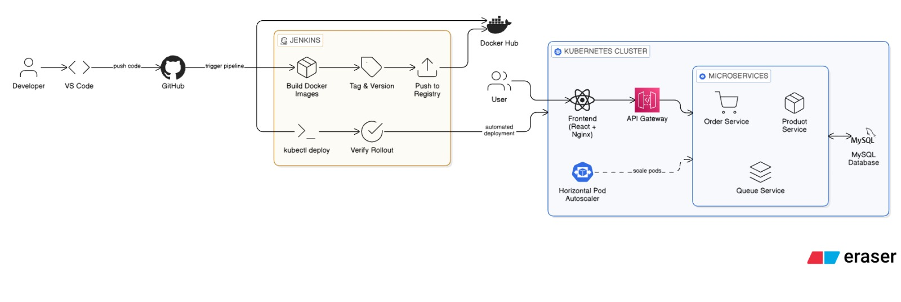

# ScaleX Flash Sale Platform

---

## Overview

---

ScaleX is a microservices-based flash sale platform designed to handle high traffic spikes using microservices architecture, containerization, and Kubernetes orchestration.

ScaleX is built to simulate real-world e-commerce flash sale systems where thousands of users attempt to purchase limited stock simultaneously. The system focuses on handling concurrency, maintaining data consistency, and ensuring high availability.

This project demonstrates practical DevOps and backend engineering skills including Docker, Kubernetes, autoscaling, and distributed system design.

---

## Architecture

---

Frontend (React + Nginx)
        ↓
    API Gateway
        ↓
   Microservices
     -> Product Service
     -> Order Service
     -> Queue Service
        ↓
   Database (MySQL)
        ↓
Docker + Kubernetes

---

## Tech Stack

---

* Backend: Node.js, Express
* Frontend: React, Nginx
* Database: MySQL
* Containerization: Docker
* Orchestration: Kubernetes (Minikube)
* CI/CD: Jenkins
* Load Testing: k6

---

## Features

---

* Microservices-based architecture
* API Gateway for request routing
* Product service for inventory management
* Order service for purchase handling
* Real-time stock updates
* Horizontal Pod Autoscaling
* Containerized using Docker
* Kubernetes deployment support

---

## Load Testing

---

### Test Configuration

---

* Virtual Users (VUs): 50 → 150 → 300
* Test Duration: ~2 minutes
* Request Type: Continuous POST requests to `/order`
* Average Requests per Second: ~130–170 req/sec

---

### Results

---

* Total Requests Handled: ~13,000 – 17,000 requests
* Success Rate: ~99%+
* Average Response Time: ~5–10 ms
* 95th Percentile Response Time: ~300 ms
* Failed Requests: 0% (after stabilization)

---

### System Behavior Under Load

---

* System remained stable under peak load
* No crashes or downtime observed
* No duplicate or inconsistent data
* Stock validation prevented overselling
* All successful requests processed correctly

---

### Scalability Observation

---

* Horizontal Pod Autoscaler triggered based on CPU
* Pods scaled up automatically under load
* System handled traffic without degradation
* Pods scaled down after load decreased

---

### Conclusion

---

The system handled thousands of concurrent requests efficiently while maintaining stability and consistency. This demonstrates the ability of the architecture to perform under high traffic conditions.

---

## API Endpoints

---

### Get Products

GET /products

---

### Place Order

POST /order
{
"productId": 1
}

---

## How to Run

---

### 1. Start Docker

sudo systemctl start docker

---

### 2. Start Minikube

minikube start --driver=docker

---

### 3. Load Images

minikube image load snesh111/frontend:v5
minikube image load snesh111/api-gateway:v7
minikube image load snesh111/product-service:v1
minikube image load snesh111/order-service:v17
minikube image load snesh111/queue-service:v1

---

### 4. Deploy

kubectl apply -f kubernetes/
kubectl apply -f frontend/

---

### 5. Access Application

minikube service frontend

---

## Challenges Faced

---

* Service-to-service communication issues
* Kubernetes networking and DNS debugging
* Database initialization errors
* Docker image caching issues
* Debugging distributed system failures

---

## Learnings

---

* Handling concurrency in distributed systems
* Kubernetes deployment and autoscaling
* Debugging microservices architecture
* Importance of logging and observability

---

## Future Improvements

---

* Add Redis for caching
* Introduce message queue for async processing
* Implement rate limiting
* Add monitoring (Prometheus + Grafana)
* Use Ingress for routing

---

## Conclusion

---

ScaleX demonstrates how a distributed microservices system can handle high traffic while maintaining stability and data integrity. It reflects real-world backend and DevOps practices used in scalable systems.
